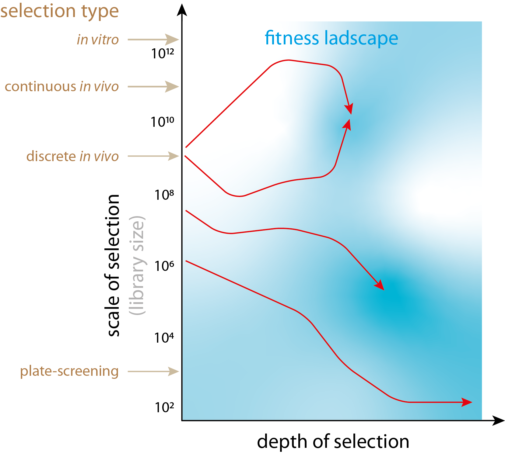

# Continuous directed evolution methods

Continuous directed evolution (CDE) methods offer a significant advantage over the discrete ones as they:

- Involve less interrogation from the experimenter. Hence, this type of DE could be significantly less laborious in the long run than the discrete DE protocols.
- *In vivo* selection is typically coupled with *in situ* mutagenesis. It leads to the generation of larger diversity libraries, i.e., it increases **selection scale** (Figure 1).
- Repeated iteration of the evolutionary protocol results in a deeper exploration of the phenotypic space, i.e., it expands the **depth of evolutionary search** (Figure 1)

<figcaption>Larger genetic library enables search of phenotype across greater sequence space (scale), while the moving along mutational landscape (depth) enables finding solutions that are far from initial phenotypic state.</figcaption>
*idea taken from Chang Liu's [recent paper](https://doi.org/10.1016/j.cbpa.2021.02.008)*

The use of both larger scale and greater depth of evolutionary search makes CDE a step closer to the natural selection systems, which may be more efficient in general and certainly more suitable for the evolution of complex systems. CDE also takes advantage of the fact that both selection and mutagenesis occurs in the same host organism, effectively cancelling several bottlenecks such transformation that is typical for discrete DE (Figure 2). Nevertheless, discrete methods could be much more straightforward to set in the lab what certainly aids to their popularity. The exploitation of viral replication machinery is a popular concept in CDE, with two most prominent examples being Phage Assisted Continuous Evolution [PACE](PACE_PANCE.md) for evolution in E.coli and viral evolution of genetically actuating sequences [VEGAS](https://www.sciencedirect.com/science/article/pii/S0092867419306221) that is accustomed for the evolution of proteins in mammalian cells. The [Adaptive Laboratory Evolution](ALE.md), in principle, can be considered as one of the CDE methods as well. Recent developments in situ mutagenesis protocols will undoubtedly lead to the development of novel CDE systems.

<figcaption>Discrete method of evolution have several stages such as transformation which leads to unpredictable loss of genetic diversity.</figcaption>

