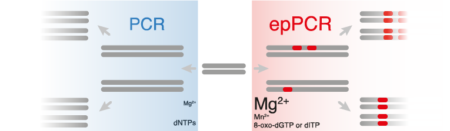

# Error-prone PCR 
 
## Introduction
Generation of a maximally diverse gene library is particularly important when employing non-targeted mutagenesis strategies. The method most often used to generate variants with random mutations is error-prone PCR (epPCR). Here we present the basic protocols and tips for using epPCR to generate gene variants that exhibit a relatively balanced spectrum of mutations and for capturing as much diversity as possible through effective cloning of those variants.
 
## The principles of epPCR
Error-prone PCR protocols are modifications of standard PCR methods, designed to alter and enhance the natural error rate of the polymerase. There are many ways to control the mutation rate of epPCR.
- EpPCR reactions typically contain higher concentrations of MgCl2 (7 mM) compared to basic PCR reactions (1.5 mM), in order to stabilize non-complementary pairs.(Ling et al., 1991)
- MnCl2 can also be added to increase the error-rate.(Lin-Goerke, Robbins & Burczak, 1997)
- Other ways of modifying mutation rate include varying the ratios of nucleotides in the reaction or including a nucleotide analog such as 8-oxo-dGTP or dITP. Mutation frequencies from 0.11 to 2% (1 to 20 nucleotides per 1 kb) have been achieved simply by varying the nucleotide ratio and the amount of MnCl2 in the PCR reaction.(Fromant, Blanquet & Plateau, 1995)
- The number of genes that contain a mutation can also be modified by changing the number of effective doublings by increasing/decreasing the number of cycles or by changing the initial template concentration.

An expression system and high-throughput assay should be developed before a library of enzyme variants are generated. epPCR provides access to an almost unlimited number of variants, but generally have a lower hit rate and are therefore better suited to high throughput screening or selection strategies. To take full advantage of the power of error-prone PCR, the assay must be accurate enough to detect small improvements and sensitive enough to detect the low levels of activity typically encountered in the beginning rounds of an evolution experiment.
 
# The procedures of epPCR
1. epPCR Reaction Preparation*
For each PCR sample, add to tube:
·   	10 μL 10X normal error-prone PCR buffer ()
·   	2 μL 50X dNTP mix
·   	Additional dNTPs [optional; increase mutation rate]
·   	10 μL 55 mM MgCl2 [optional; increase mutation rate]
·   	10 μL 55 mM MnCl2 [optional; increase mutation rate]
·   	30 pmol each primer [design your primers before]
·   	2 fmol template DNA (~10 ng of an 8-kb plasmid) [Prepare your template before]
·   	1 μL Taq polymerase (5U)
·   	H2O to a final volume of 100 μL.
There are also some commercial available epPCR Kits: (Agilent)[https://www.agilent.com/en/product/mutagenesis-cloning/mutagenesis-kits/random-mutagenesis-kits/genemorph-ii-233115], (TakaraBio)[https://www.takarabio.com/products/cloning/mutagenesis-kits/random-mutagenesis-kit]

2. Run Error-Prone PCR Program
·   	30 s at 94°C
·   	30 s at annealing temperature for primers
·   	1 min at 72°C (for a ~1 kb gene)
·   	35-50 cycles (more cycles can increase mutations)
·   	5 min at 72°C final extension
·   	4°C (to protect samples overnight if necessary)
 
3. Construct the library
Using Gibson Assembly or Goldengate Assembly for library construction.
3.1 Gibson Assembly(Gibson et al., 2009)
 
- Gibson Mix Buffer(2x) 5μl
- Vector backbone 25 fmol
- Each insert 50 fmol
- H20 To make 10 μl

50℃, 1 hour.
 
4. Goldengate Assembly
Type IIs RE 0.50μl
T4 ligase 0.50μl
Vector backbone 25 fmol
Each insert 50 fmol
Goldengate buffer 1 μl
H20 To make 10 μl

- Step 1, RE digestion
37℃(BsaI) or 42℃(BsmaI)	2 min
- Step 2, Ligation
16 °C 5 min
- Step 3, RE digestion
60 °C 10 min
Step 1-3 repeat 25 cycles
Step 4 Heat inactivation
80 °C 10 min
Hold
4 °C
∞

 
5. Transformation
Prepare a high-efficiency cell library like E. coli or yeast for transformation. (key step). See more information: Transformation of genetic library.
 
6. Selection
Using a designed selection method for selection. More information is coming soon. 

Very comprehensive protocol for students:
https://experiments.springernature.com/articles/10.1007/978-1-4939-1053-3_1

# References
Fromant, M., Blanquet, S. & Plateau, P. (1995) Direct Random Mutagenesis of Gene-Sized DNA Fragments Using Polymerase Chain Reaction. Analytical Biochemistry. [Online] 224 (1), 347–353. Available from: doi:10.1006/abio.1995.1050.

Gibson, D.G., Young, L., Chuang, R.-Y., Venter, C.J., et al. (2009) Enzymatic assembly of DNA molecules up to several hundred kilobases. Nature Methods. [Online] 6 (5), nmeth.1318. Available from: doi:10.1038/nmeth.1318. 

Ling, L.L., Keohavong, P., Dias, C. & Thilly, W.G. (1991) Optimization of the polymerase chain reaction with regard to fidelity: modified T7, Taq, and vent DNA polymerases. Genome Research. [Online] 1 (1), 63–69. Available from: doi:10.1101/gr.1.1.63. 

Lin-Goerke, J.L., Robbins, D.J. & Burczak, J.D. (1997) PCR-Based Random Mutagenesis Using Manganese and Reduced dNTP Concentration. BioTechniques. [Online] 23 (3), 409–412. Available from: doi:10.2144/97233bm12.
 

