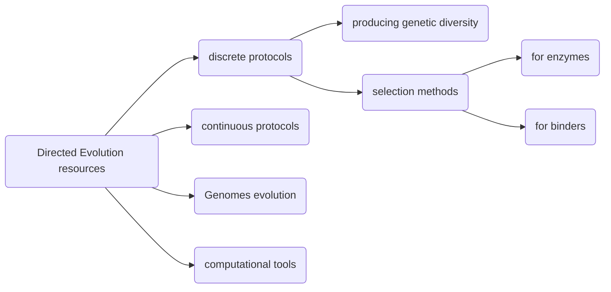

# Introduction

Directed evolution (DE) aims to improve the activity of biological entities (molecules, bacterial strains etc.) via exploiting principles of Darwinian selection in a controlled laboratory environment. DE is performed in rounds by repeating two main steps: diversification of a genetic material and selection of the molecules encoded by it for the desired property. The evolution experiments spans from the living cells, their consortia (ecosystems) to heavily reduced in complexity *in vitro* systems (e.g. transcription-translation).

Importantly, DE is inherently probabilistic, and hence its exact outcomes are unpredictable, just as natural evolution is. Thus, DE strategies are perfectly fit for harnessing biological complexity whereby unpredictability and irrationality, however still unwanted, are increasingly considered to be an asset. Indeed, random search and feedback controls, which are inherent parts of any DE approach are the only language nature engages. Development of the DE field creates possibilities to work with living systems, guiding their genetic algorithms, by following rules of these systems as opposed to controlling them. From this point of view, DE is may be the furthest from rational engineering in the realm of synthetic biology.

A thorough understanding of the DE experimental design is required to increase the chances for its successful implementation. This resource is here to help you with this. It gives a basic overview of the types of DE experiments, their experimental logic, ways to create and characterise genetic libraries, design selection schemes and perform final analysis.

Importantly, This page is not intended to be complete but rather to be a welcoming and informative resource for you to learn more about the marvellous field called Directed Evolution!

DE field is vast and its subjects and protocols are not uniform. We classified DE methods according to the best of our knowledge and thus it reflects our *vision*. Importantly, we do not differentiate between true DE (which is an umbrella term for various approaches) and the selection strategies. We subdivided DE protocols into two large divisions: methods for generation of genetic diversity and methods for selections.

The latter is further subdivided into the selection of binders and the selection of enzymes. Also, we could not ignore two important fields of research: continuous DE and Genomes evolution. And finally, we added  a chapter on computational tools for genetic library design and characterisation

- [Creating genetic diversity](genetic_diversity.md)
-- [Error-prone PCR](epPCR.md)
-- [Comprehensive Codon Mutagenesis](CCM.md)
-- [Recombinatorial gene and domain shuffling](gene_shuttling.md)
- Laboratory Selection methods
  - [Selection of binders](binders.md)
    - [Phage display](phage_display.md)
    - [Cell surface display](FACS_FADS.md)
    - [Ribosome display](ribodisplay.md)
    - [cDNA display & mRNA display](mRNAdisplay.md)
    - [CIS display](cisdisplay.md)
    - [SELEX](selex.md)
  - [Selection enzymes and reporters](enzymes.md)
    - [Screening based on survival](survival.md) 
    - [Selection based on biochemical assays](biochem.md)
    - [Selection using *in vitro* compartmentalisation](CBL.md)
- [Continuous directed evolution methods](continuous.md)
-- [Phage-assisted continuous evolution](PACE_PANCE.md)
-- [*In situ* targeted mutagenesis (EvolvR, OrthoRep)](insitu_mut.md)
- [Computational tools for library creation, design and analysis](computational.md)
- [Genome evolution](genomes.md)
-- [MAGE](mage.md)
-- [Adaptive Laboratory Evolution](ALE.md)
-- [Scramble](scramble.md)

