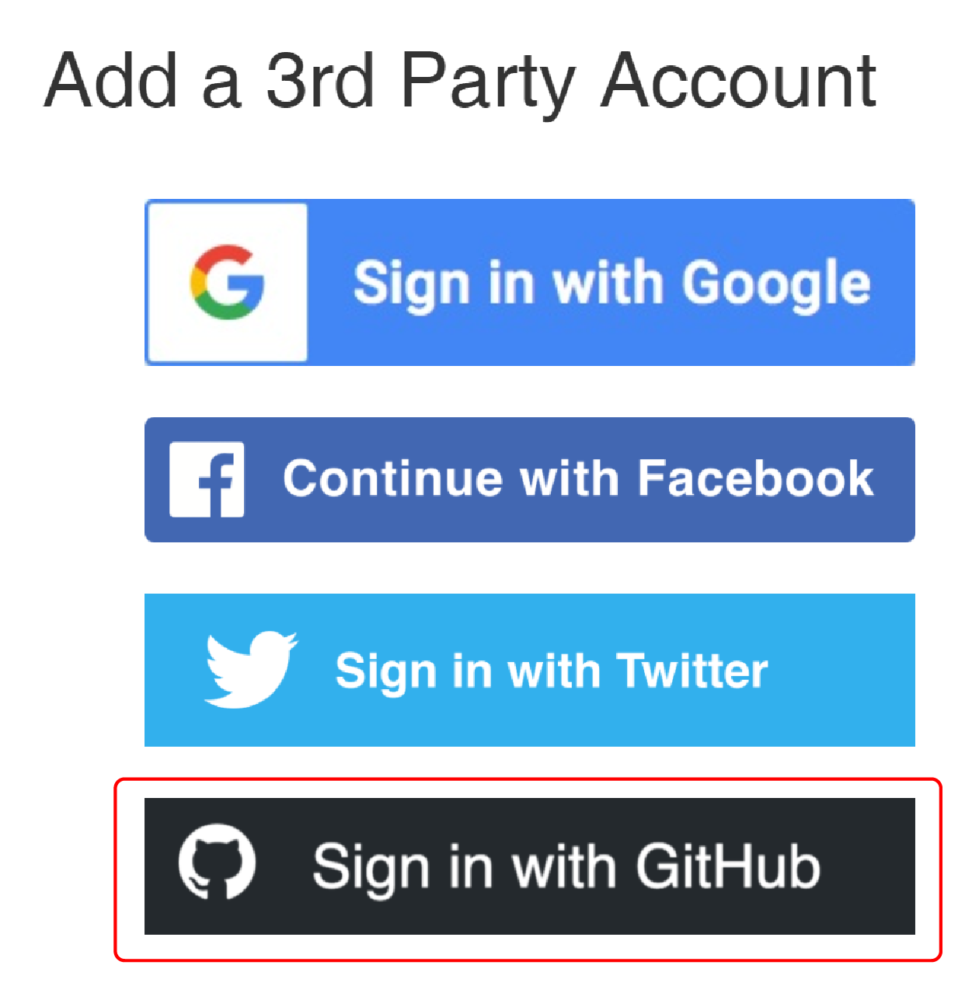

# Accessing your wiki repository

You will need permission to write directly into and configure settings in your team wiki repository. To do so, follow the steps below:

1. [Register for a GitHub account](https://github.com/join/) if you do not have one yet
2. Go to [reg.idec.io/accounts/social/connections/](https://reg.idec.io/accounts/social/connections/) and sign in
3. Under **Add a third party account**, click **Sign in with GitHub**  
    { width=150px }  
4. Authorize the iDEC Team Portal app  
    Take note that:  
        a. App is created by **idechq-bot**  
        b. App redirects to **https://reg.idec.io/**  
    { width=350px }  
5. Check that your GitHub account is now connected to your registered account  
    { width=400px }  
6. Go to the **Team** tab
7. Click the green **GitHub** icon button for your team  
    { width=400px }  
8. You will be redirected to a new page. 
    Here, check that your team information is correct
    { width=400px }  
9. At the bottom of the page, the system should have detected your connected GitHub username(s)
10. Pick the username you want to add, if you connected multiple GitHub accounts
11. Click on the submit button
12. You should see *3 success messages* near the top of the page if you are successfully invited
    { width=400px }  
13. Check your email (the one registered with GitHub) and look for an invitation to join the repository
14. Accept the invitation
15. You can now manage your wiki repository with **[maintain](https://docs.github.com/en/organizations/managing-access-to-your-organizations-repositories/repository-permission-levels-for-an-organization#repository-access-for-each-permission-level)** permission

!!! attention
    You will not be able to join your assigned wiki repository when wiki-freeze commences.

## Error due to double connections

You cannot connect the same GitHub account more than once to the iDEC Team Portal. If you run into a "Social Login" failure page, it could be due to your attempt to connect your GitHub account again. A potential fix for this issue, is to login to your GitHub account and visit the settings, [applications](https://github.com/settings/applications) configuration. Under **Authorized OAuth Apps**, choose **iDEC Team Portal**, and then **Revoke access**. This will disconnect your GitHub account with the Team Portal and you can try to reconnect again.

## Other issues?

If you run into any issues please contact us in our [Slack workspace iDEC2021](https://idec2021.slack.com).  
  
You can also email us at [support@idechq.org](mailto:support@idechq.org).