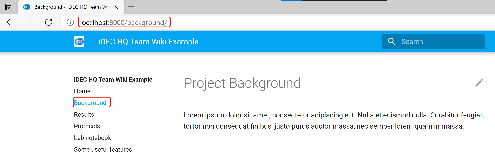

# Set up an environment for wiki editing

Now that you have a local repository, you can create a local **live server**. When you make changes to the file in the local repository, the live server will let you visualize those changes immediately.

We need to set up an environment for the live server. There are two ways do so:

1. Install a Python environment and the dependencies  
   (simplier for Windows and not so friendly for Macs)

2. In a Docker container  
   (recommended for Mac, also for Windows users who aim to get the most robust environement)

## Python

### Installation

1.  Install [Python](https://www.python.org/downloads/)  
    or  
    Install [Anaconda](https://www.anaconda.com/products/individual)
2.  On Mac, open a command line terminal  
    On Windows, open the Python terminal, or, the Anaconda Prompt
3.  In the terminal, run the command:

        pip install mkdocs-material

    Wait for the process to complete

### Serve

1.  In the terminal, navigate into the `team-wiki` folder where your local repository is, e.g..:

        cd.. Documents/GitHub/team-wiki

2. In the terminal that is already opened, run:  
        
        mkdocs serve

## Docker

Docker container. This ensure that you will always get the same environment for running certain application, regardless of the operating system / existing software that you have already installed on your computer.

### Installation

1.  Install [Docker Desktop](https://www.docker.com/products/docker-desktop)
    Windows users will need to follow enable Windows Subsystem for Linux (WSL2) beforehand
    See the [Docker documentation](https://docs.docker.com/docker-for-windows/install/) for doing so.
2.  Open a command line terminal  
    For Windows users, open a PowerShell / Linux terminal
3.  In the terminal, run the command:

        docker pull squidfunk/mkdocs-material

    Wait for the process to complete

### Start a container

4.  In the terminal, navigate into the `team-wiki` folder where your local repository is, e.g..:

        cd.. Documents/GitHub/team-wiki

5.  Run the command `ls`, you should see a list of files and a folder, including:

    - the `docs` folder where .md files are stored, the wiki contents are in the .md files
    - `mkdocs.yml`, a configuration file
      { width=500px }

6.  Run the following command in the terminal to set up a local live server:

        docker run --rm -it -p 8000:8000 -v ${PWD}:/docs squidfunk/mkdocs-material

    You should see a message saying that changes are being detected:  
    { width=500px }

7.  Do not close the terminal and return to your desktop

!!! caution  
 If you close the terminal by accident, the following steps will not work.  
 In that case, open a new terminal and start from Step 4 again.

## Visualize changes in real time

Whether you are using a Docker container or a Python environment, the rest of the steps are the same.

1.  Open your browser of choice (e.g. Chrome, Safari, Firefox, etc.),  
    connect to the live server by typing `localhost:8000` in the address bar and hit ++enter++  
    You should now see the wiki site being rendered locally  
    { width=800px }

2.  In the browser, click on "Background" in the lefthand side navigation menu  
    Or, go to `localhost:8000/background/`  
    You will see a most empty page  
    { width=800px }

3.  Use any integrated development environment (IDE) or plain text editor of your choice,
    e.g. [VS Code](https://code.visualstudio.com/), Notepad (Windows) or TextEdit (MacOS),
    open the file `docs/bakground.md` in your local repository folder
    You should see an empty file

4.  Copy and paste the following texts into `docs/bakground.md`, then save the file and close it

        # Project Background

        Lorem ipsum dolor sit amet, consectetur adipiscing elit. Nulla et euismod
        nulla. Curabitur feugiat, tortor non consequat finibus, justo purus auctor
        massa, nec semper lorem quam in massa.

5.  Return to the browser at `localhost:8000/background/`
    You should now see the page being populated with the new title and content
    { width=800px }

## Shut down the container

When you are done editing and no longer need your browser,
go back to the terminal, hit ++ctrl+c++ on your keyboard to exit the live server.

{ width=500px }

Screenshot above is for Docker, but the message will be the same for a Python environment.  

Once you have done so, refreshing the page should give you a 404 error.  

In the future, should you wish to start the live server again, you do not need to repeat the installation steps.
