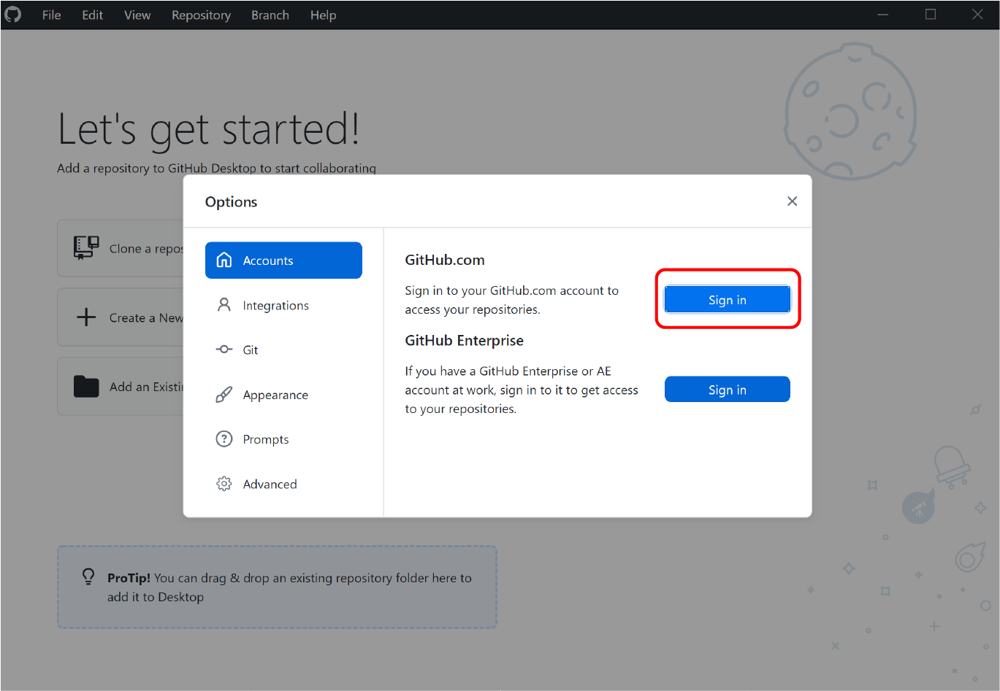

# Fork a repository

Since you will be assigned a GitHub repository for uploading your wiki contents and deploying your team wiki, it is vital that you know how to manage the repository. This tutorial is here to help you familarize with the basic operations in GitHub, assuming no prior experiences.

Instead of using your assigned repository, we will use a mock repository at:  
[www.github.com/idec2021/team-wiki](https://www.github.com/idec2021/team-wiki)  

The actual wiki for this repository can be found at:  
[idec2021.github.io/team-wiki](https://idec2021.github.io/team-wiki)  

Note that this mock repository resembles your assigned repository for team wiki, but the two repositories, and hence the wikis, are not the same. Nevertheless, the steps covered in this tutorial are applicable to your own repository.  

By the end of this tutorial, you will have a copy of this repository under your own GitHub account _and_ in your own computer.

1. [Register](https://github.com/join/) for a GitHub account

2. Install [GitHub Desktop](https://desktop.github.com/)

3. Open the **GitHub Desktop** app, select "File" -> "Options"
   { width=500px }

4. In the "Options" window, under "GitHub.com", click on "Sign In"
   { width=500px }  
    Follow the instructions and sign into your registered account

5. Go to the mock repository  
   [github.com/idec2021/team-wiki](https://www.github.com/idec2021/team-wiki)

6. On the upper right corner, you will find the "Fork" button  
   Fork the mock repository under your own account.  
   { width=300px }

7. You should be automatically redirected to the forked repository:

   ```
   https://github.com/{your username}/team-wiki
   ```

8. Check that under the repository name, it says

   > forked from idec2021/team-wiki

   And under the "Code" tab, you should find

   > This branch is even with idec2021:main.

   { width=500px }

9. Click on the green button for downloading the code, and underneath select "Open with GitHub Desktop".  
   { width=300px }  
   Continue the steps on GitHub Desktop, and this process will "clone" the repository to your local computer.

You now have a **copy** of the repository under your GitHub account. This copy is the **remote** copy.  
You also have a copy on your own computer, and this is the **local** copy.

You can now edit the contents of your local repository.
