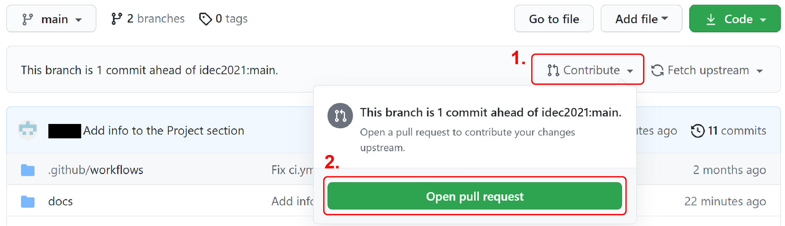
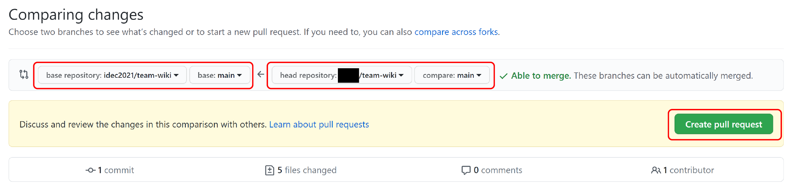

# Submit a pull request

In the previous sections you made changes to the files in your repository and committed those changes to your repositories, both local and remote. At this point, these changes are yours, and they are not part of the original, HQ maintained wiki repository. This is the same as saying, you have a partially or fully completed wiki in your own hands but it is not submitted to the iDEC HQ yet.

To finalize the submission, you will need to signal to the owner of the original repository (iDEC HQ) that you committed some changes, and those commits are ready to be merged into the original repository. This process is submitting a **pull request**. Typically, when the owner of a repository receive a pull request, the owner reviews the pull request, then decides if the commits should be merged into the original repository. However, since iDEC is using GitHub repositories as means for wiki hosting, we will not review your changes and just accept them as they are. Though, we will only accept pull requests created before but not after a certain deadline. This is how we implement the _wiki freeze_.

In this secion, you will create a pull request for the changes you did on your `team-wiki` repository. This process will be basically identical to what your team will do when you submit your official team wiki.

Follow the steps below:

1. Open a browser, signin to your GitHub account

2. Travel to your forked repository on GitHub:  
   `https://www.github.com/{your username}/team-wiki`

3. Check again for the message that says:

   > This branch is { a number } commit(s) ahead of idec2021:main.

4. Click on the `Contribute` link, then click on `Open pull request`  
   { width=500px }

5. This will lead you to a new page, which shows all differences between your edits and the original files  
   Make sure that:  
  
      - base repository is `idec2021/team-wiki`
      - head repository is `{your username}/team-wiki`
      - branches being compared are both `main`

6. Click on the `Create pull request` button  
   { width=600px }

7. Click the `Create pull request`  
   { width=600px }

8. Travel to the original repository:  
   `https://github.com/idec2021/team-wiki/pulls`  
   You will see your pull request being logged on the system.  
   { width=600px }

Since this `team-wiki` repository was set up for this tutorial, the iDEC HQ will not accept any pull requests and your pull request will remain open indefinitely.

!!! info  
    It is not necessary to submit a pull request every time you push a commmit. You can create a pull request after a number of commits are pushed and by default they will be grouped under the same pull request.

!!! tip  
    In this tutorial section we use the default pull request title and leave the comment section empty for simplificity. In the future, however, it is important to write meaningful titles and descriptions. Check out this [blog post](https://www.pullrequest.com/blog/writing-a-great-pull-request-description/) for some suggestions on how to write a pull request description.
